# 交差エントロピー

## これは?

MNISTの損失関数に交差エントロピーを使って各クラスへの確らしさを求めたい、というものです。

MNISTの3を除く 0, 1, 2, 4, 5, 6, 7, 8, 9 の９クラスで学習して、3を推論するとどうなるか、をみます。

## 推論結果

右側の数字が各クラスの確らしさです。3以外は1.00000となって、3の場合は（学習データに3がないので、推論で3とはならなくて）他の数字の確らしさが0より大きくなっています。

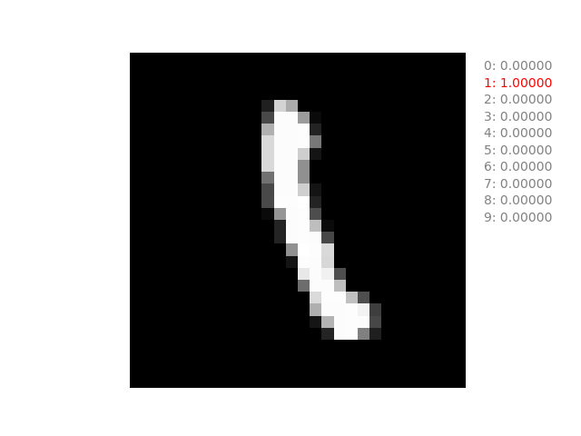
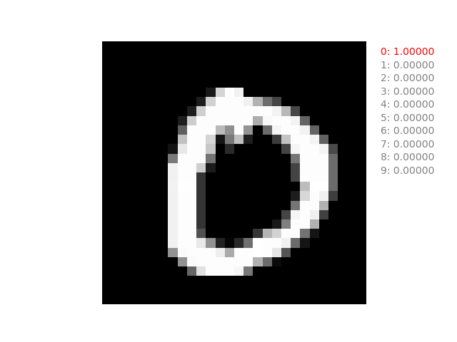
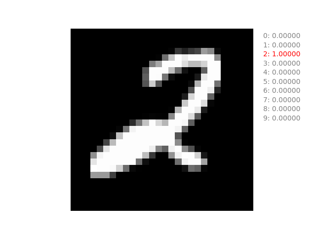
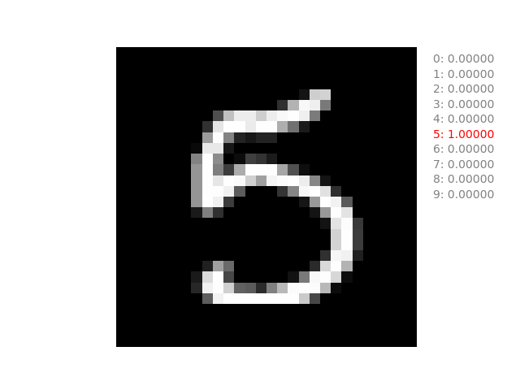
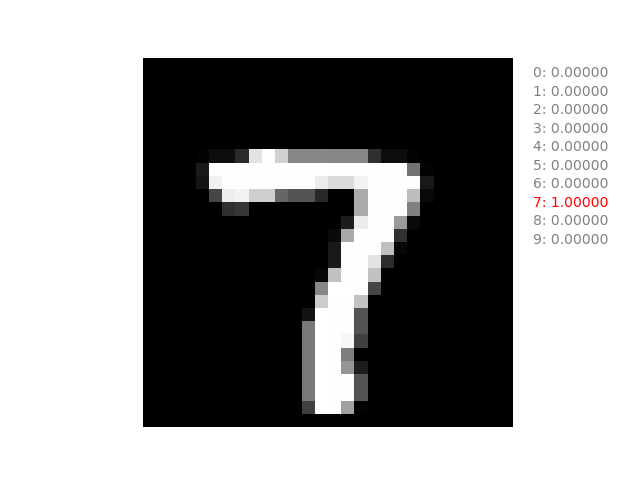
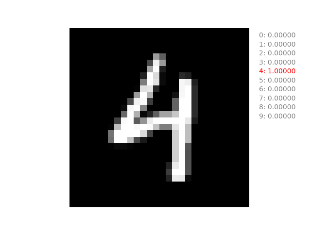
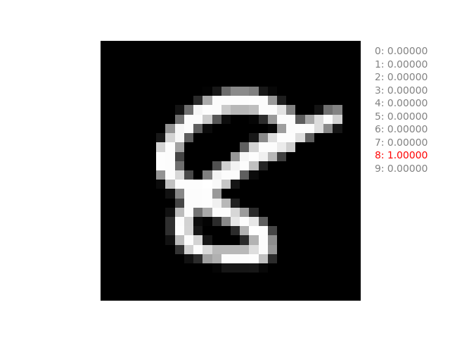
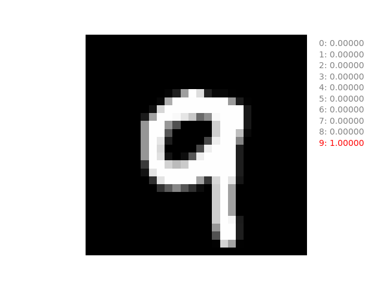
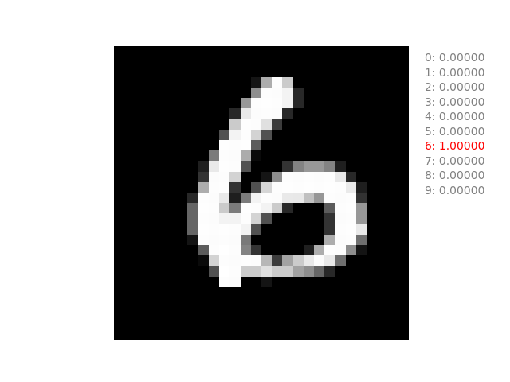

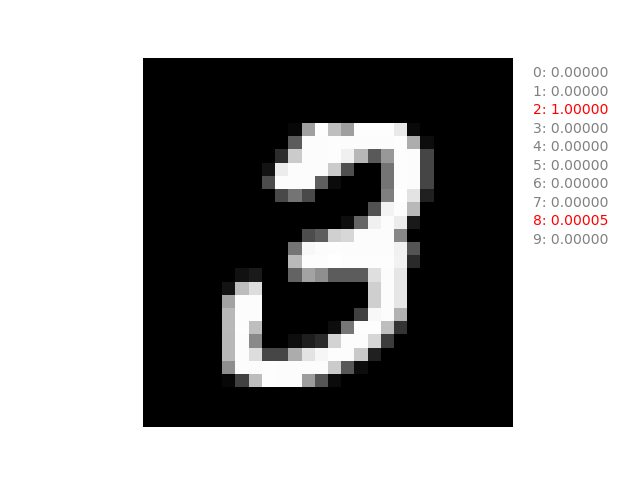
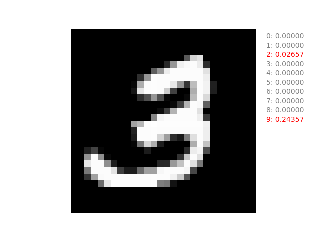
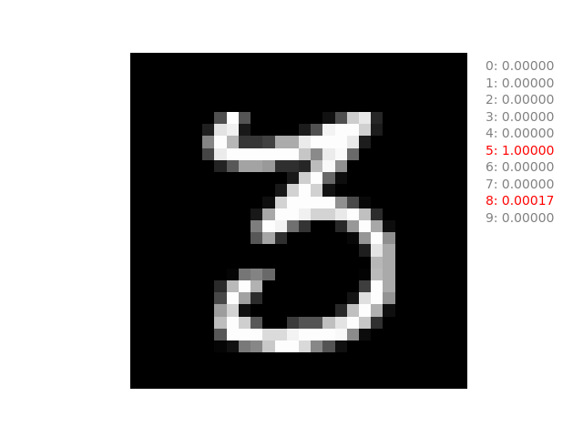
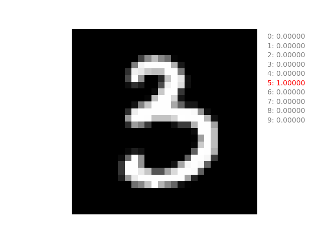
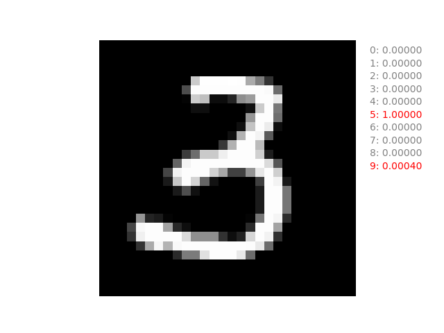
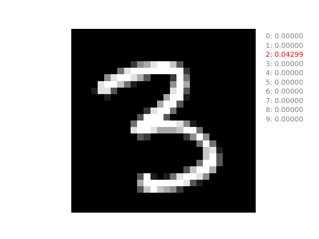
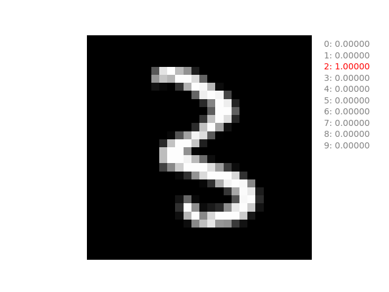
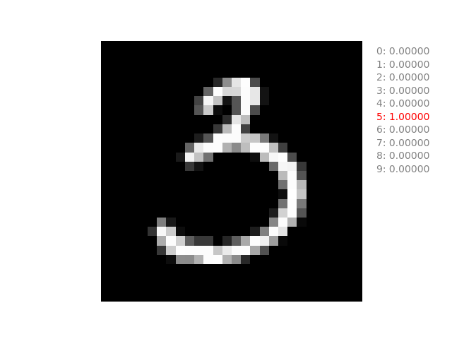
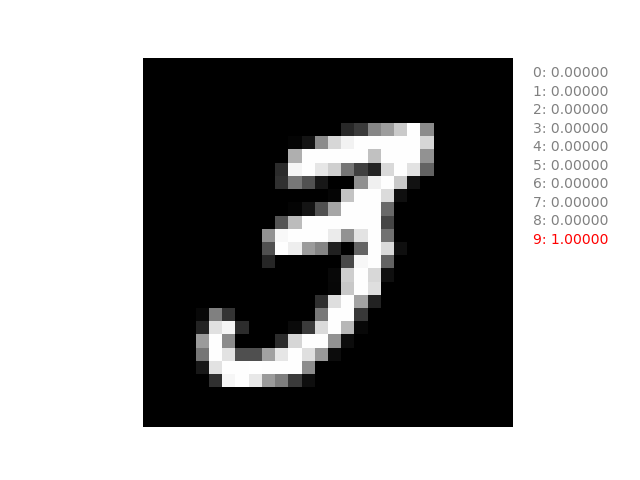
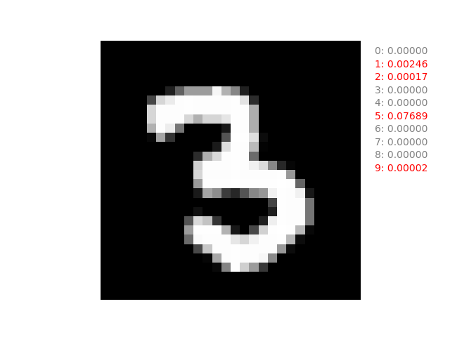
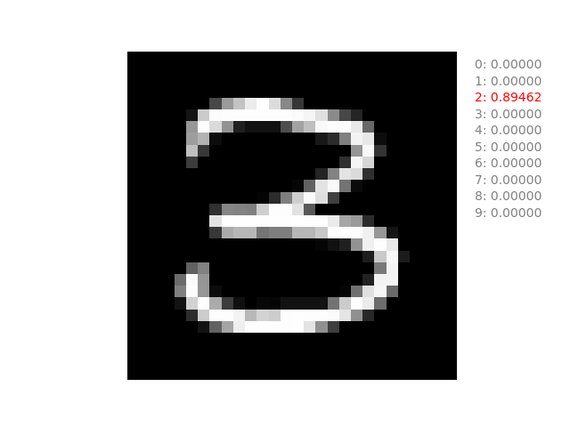
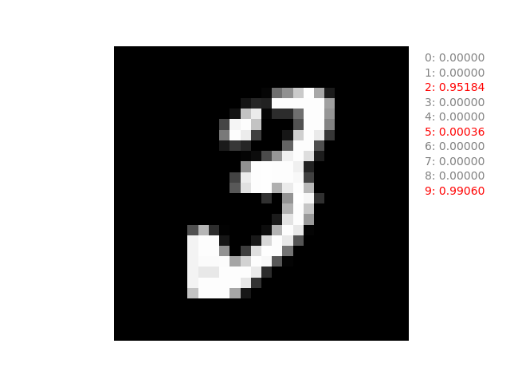
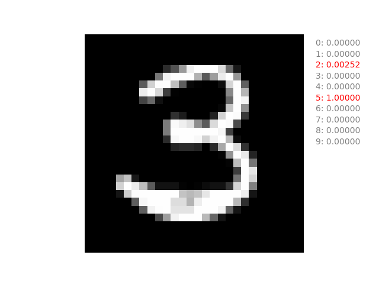
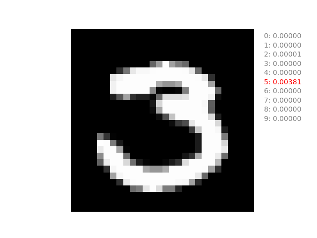
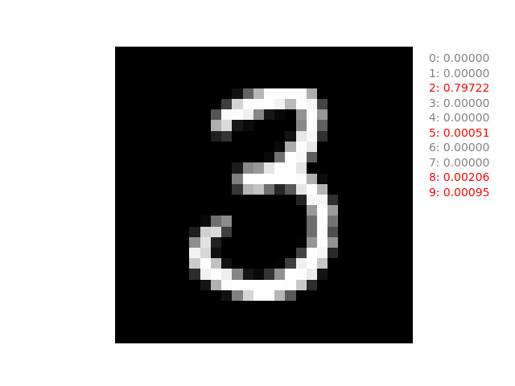
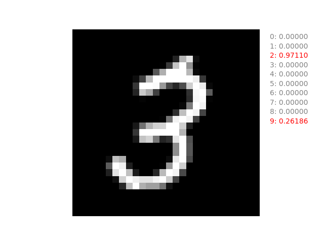
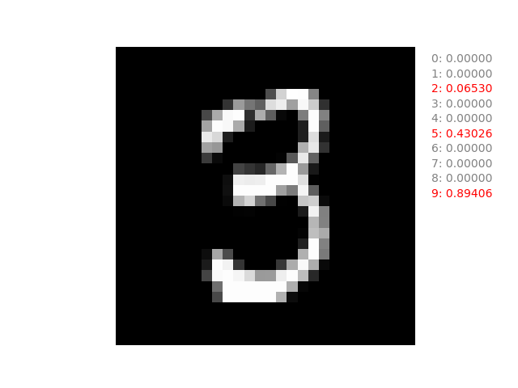
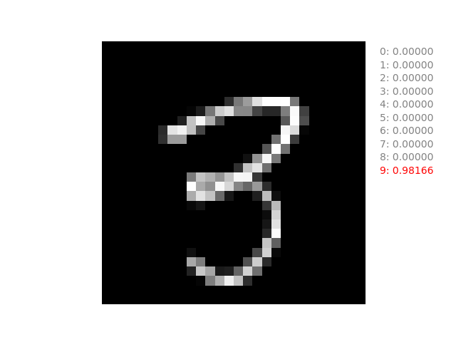
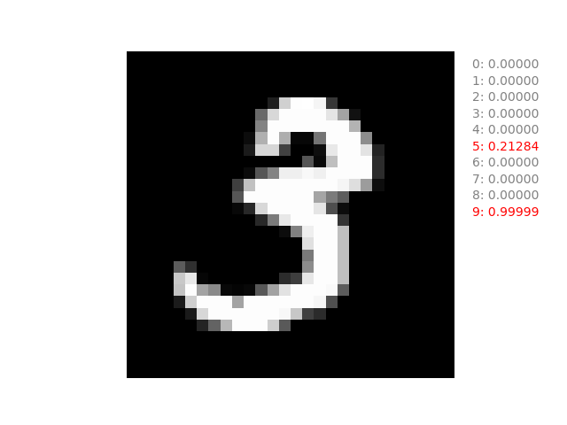

## ?

ネットワークの出力に sigmoid を入れるのは間違いかもしれない。
